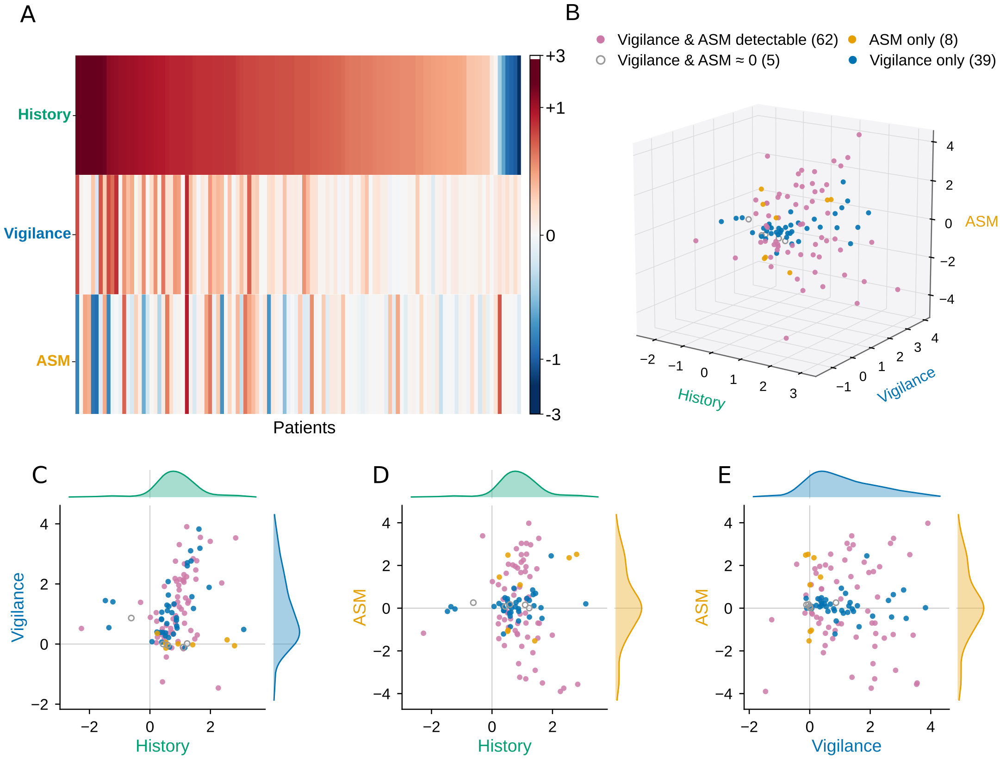
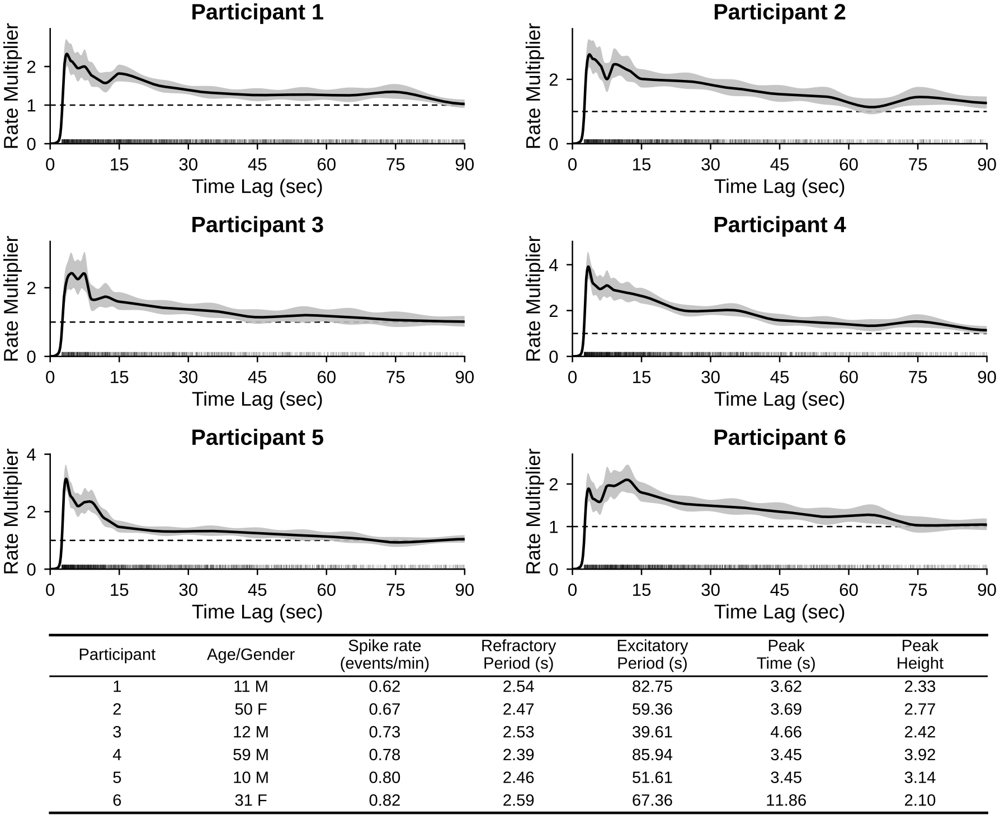
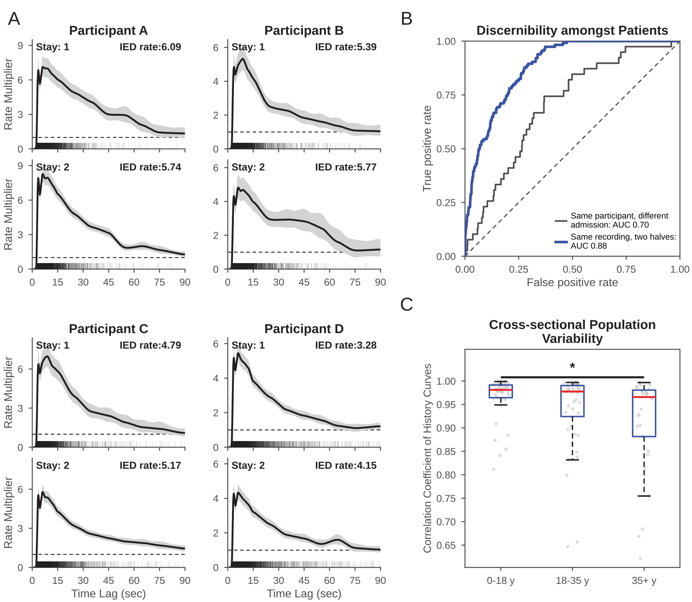
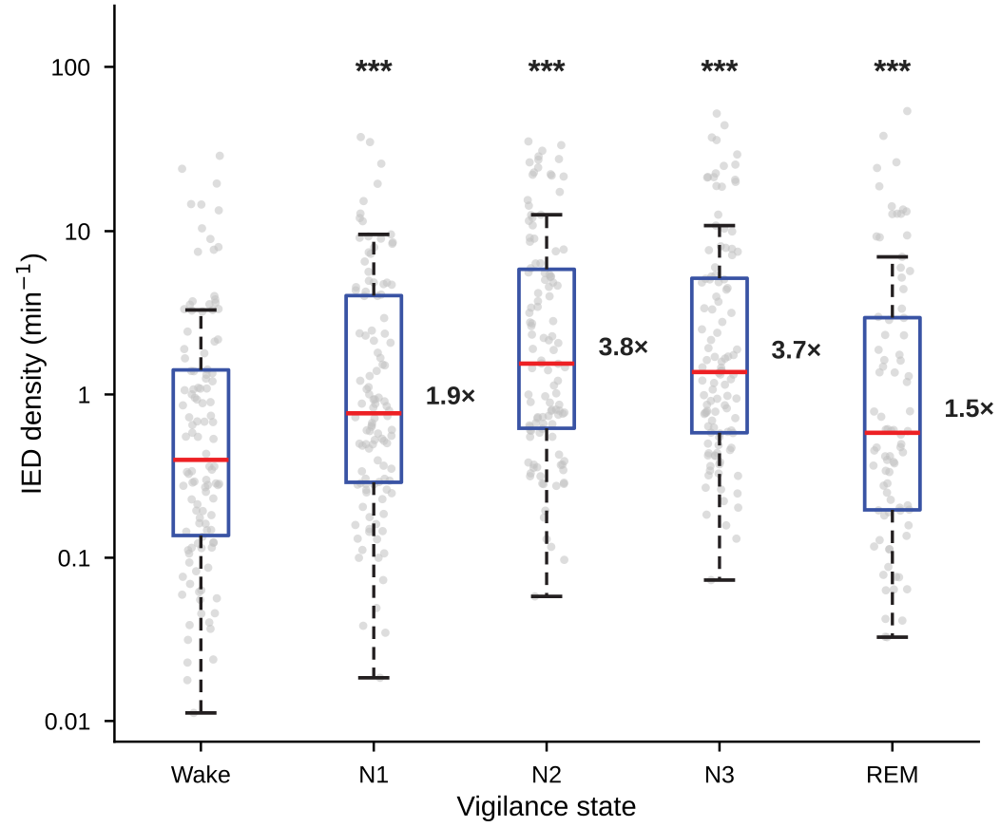

<div align="center">

# IED Temporal Organization

### Reproducibility resources for *Patient-specific temporal dynamics organize interictal epileptiform activity in human epilepsy*


</div>

This repository accompanies the Brain manuscript by Keldsen and colleagues. It contains the manuscript figures, supplementary appendix, analysis-ready deidentified derivatives, and deterministic checks for the reported results. The release is deliberately small: it preserves the quantities needed to inspect and reproduce the paper without exposing source identifiers, calendar dates, or clinical timelines.

<p align="center">
  
</p>

## At a glance

| Cohort | Recordings | Model | Public data |
|:--|:--|:--|:--|
| 114 epilepsy-monitoring-unit participants | Multiday recordings from two hospitals | Point-process GLMs of history, vigilance, and model-estimated ASM exposure | Pseudonymous curves, coordinates, confidence intervals, and aggregate summaries |

Recent IED history accounted for 97.5% of pooled standalone held-out improvement and retained a 76.7% unique contribution after vigilance and ASM exposure were considered. Participant-specific history curves were highly reproducible: median split-half residual correlation was 0.965, and median cross-admission residual correlation was 0.905 among 39 participants with qualifying repeat recordings.

## Figure gallery

<table>
  <tr>
    <td width="50%"><br><sub><b>Figure 3.</b> Similar IED rates, distinct history-dependence profiles.</sub></td>
    <td width="50%"><br><sub><b>Figure 4.</b> Within-recording and cross-admission reproducibility.</sub></td>
  </tr>
  <tr>
    <td width="50%"><br><sub><b>Figure 6.</b> Absolute IED density across vigilance states.</sub></td>
    <td width="50%"><br><sub><b>Supplementary Figure S3.</b> Kernel features and cohort characteristics.</sub></td>
  </tr>
</table>

## Quick start

```bash
python3 -m venv .venv
source .venv/bin/activate
python -m pip install -r requirements.txt
make verify
make figures
```

`make verify` checks cohort membership, manuscript-defining statistics, figure inputs, artifact hashes, prohibited columns, identifier-shaped strings, dates, local paths, and credential patterns. `make figures` writes public-safe reproductions to `figures/reproduced/`.

## Repository map

```text
data/deidentified/       Analysis-ready pseudonymous and aggregate derivatives
figures/manuscript/      Frozen manuscript figure renders
figures/reproduced/      Figures regenerated from public data
supplement/              Final appendix, figures, TeX, and aggregate source tables
scripts/                 Reproduction and release-validation programs
docs/                    GitHub Pages landing page
provenance/              Artifact and release SHA-256 manifests
```

The [data dictionary](DATA_DICTIONARY.md) documents every public table. [Reproducibility](REPRODUCIBILITY.md) explains which outputs can be rebuilt from this release, while [privacy](PRIVACY.md) records the release boundary and the checks used to enforce it.

## Data boundary

The repository does **not** contain source patient identifiers, the private crosswalk, calendar timestamps, admission/session identifiers, patient-level site or demographic tables, full event sequences, raw longitudinal EEG, source Parquet timelines, medication administration records, clinical notes, or credentials. Public IDs such as `P042` are arbitrary research labels. The machine-readable demographic material is aggregate only.

The 90-second Figure 1 excerpt is supplied on relative time with channel labels and no recording date. Full source data remain under institutionally governed access. See [PRIVACY.md](PRIVACY.md) before redistributing derived files.

## Supplement and citation

The final [supplementary appendix](supplement/supplementary_appendix.pdf) is included alongside its TeX and figure sources. If you use this repository, cite the accompanying manuscript; structured citation metadata are provided in [CITATION.cff](CITATION.cff).

Code is available under the MIT License. The deidentified data and figures are available under CC BY 4.0; see [LICENSE-DATA.md](LICENSE-DATA.md).
