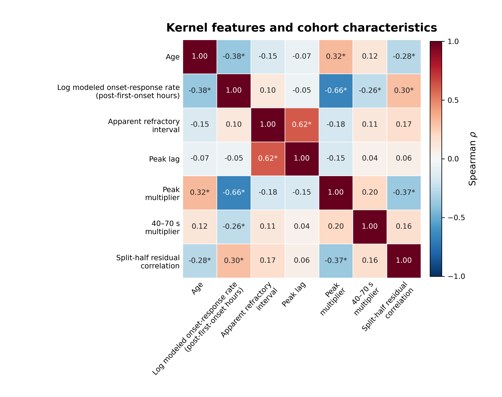

# IED Temporal Organization

**Deidentified result data, manuscript figures, and reproducibility resources for Keldsen et al.**

Recent interictal epileptiform discharge history was the dominant determinant of moment-to-moment activity in 114 epilepsy-monitoring-unit participants. The fitted history architecture was individualized yet reproducible within recordings and across qualifying admissions.

| 114 participants | 39 repeat-recording participants | 90-second history window |
|:--:|:--:|:--:|
| Two-hospital cohort | Median cross-admission `r = 0.905` | History, vigilance, and ASM model |

## Explore the results

| Rate-matched histories | Reproducibility |
|:--:|:--:|
|  |  |

| Sleep-state density | Kernel-feature correlations |
|:--:|:--:|
|  |  |

The repository includes analysis-ready pseudonymous derivatives, the final supplementary appendix, deterministic figure scripts, a detailed data dictionary, and a release gate that checks both scientific claims and privacy invariants.

[Explore the public data](data.md) · [Read the privacy design](privacy.md) · [Open the supplementary appendix](assets/supplementary_appendix.pdf)
